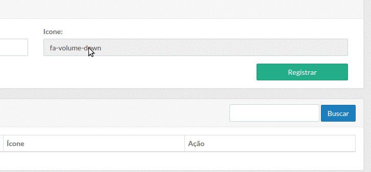

# fa-picker

[](https://www.npmjs.com/package/fa-picker)
[](https://travis-ci.org/RafaelC457ro/fa-picker)
[](https://github.com/sindresorhus/xo)

> Simple font-awesome picker.



## Table of Contents

- [Install](#install)
- [Usage](#usage)
- [Support](#support)
- [Contributing](#contributing)
- [License](#license)

## Install

This project uses [node](http://nodejs.org) and [npm](https://npmjs.com).
Go check them out if you don't have them locally installed.

```sh
$ npm install --save fa-picker
```

## Usage

```js
import faPicker from 'fa-picker'

const input = document.querySelector('input')

faPicker(input)

```

## Contributing

See the [contributing file](CONTRIBUTING.md).

## License

[MIT License](LICENSE) &copy; [Rafael Castro](https://github.com/RafaelC457ro)
